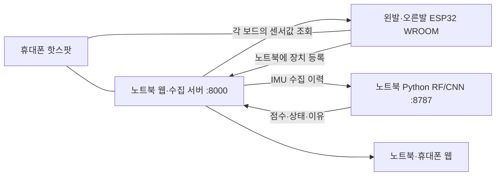

# StepOn final — ESP32 WROOM · 웹 · AI 통합 사용 설명서

2026-09-21 기준으로 현재 사용하는 코드를 모은 독립 브랜치입니다. `master`·`wongi`의 커밋 이력을 이어받지 않으며, 기존 브랜치는 변경하지 않습니다. 설치부터 배선, 핫스팟, 양발 설정, 실시간 분석, CSV 수집과 결과 해석까지 이 문서에서 안내합니다.

**평소 실행은 `run.bat` 하나입니다.** ESP32에는 4-2 펌웨어를 올리고, RF/CNN 모델은 노트북에서 실행합니다. 새 PC에서는 `setup-ai.bat`을 먼저 실행합니다.

> 현재 4-2 설정은 **SDA=GPIO13, SCL=GPIO14, MUX S2=GPIO4(D4), 압력=C0/C2/C4/C6**입니다. 실제 배선과 맞춰 양쪽 보드에 다시 업로드하세요. `PC_HOST`는 노트북의 현재 Wi-Fi IPv4로 설정합니다.

## 목차

- [1. 포함 파일과 시스템 구조](#contents)
- [2. 내려받기와 최초 설치](#install)
- [3. WROOM 배선과 펌웨어 업로드](#firmware)
- [4. 휴대폰 핫스팟과 양발 연결](#network)
- [5. 매번 실행·종료하는 방법](#run)
- [6. 실시간 AI 분석](#live)
- [7. 웹에서 CSV 기록·분석](#csv)
- [8. 어떤 상황을 측정할까](#protocol)
- [9. 데이터 형식과 점수 의미](#model)
- [10. USB CSV 수집 — 선택 기능](#usb)
- [11. 카메라·변화 추이·편집 화면](#other)
- [12. 저장 위치와 백업](#storage)
- [13. 문제 해결](#troubleshooting)
- [14. 개발·검증·업데이트](#verification)

<a id="contents"></a>
## 1. 포함 파일과 시스템 구조

| 파일 / 폴더 | 역할 |
|---|---|
| `run.bat` | 웹·수집·AI 전체 실행 |
| `setup-ai.bat` | Python 가상환경과 AI 의존성 설치 |
| `run-web.bat`, `run-ai.bat` | 웹 또는 AI만 개별 실행 |
| `stop.bat` | 이 프로젝트에서 실행한 서버 종료 |
| `check-network.bat` | 노트북 IP·서버·양발 연결 상태 점검 |
| `cap_web/` | 웹·모바일·편집 화면, 센서 수집 서버, 카메라 모델 자산, 검사 코드 |
| `web/ai_bridge/` | 실제 IMU 수집 이력, 개인 보정, RF/CNN 추론, CSV 분석 |
| `ai_engine/` | 첨부 엔진의 Python 패키지·학습 보조 코드·배포 모델 가중치 |
| `firmware/stepon_c3/04_2_sta_bilateral_wroom/` | 현재 WROOM 무선 연결용 펌웨어와 설정 |
| `firmware/stepon_c3/06_bmi270_csv_wroom/` | 이전에 사용한 WROOM USB CSV 수집기와 검사 코드 |

상위 폴더 이름 `stepon_c3`는 기존 경로를 유지한 것입니다. 위 **4-2와 06은 WROOM용**입니다. 이전 Flutter 앱, 별도 시제품 사이트, C3/AP 펌웨어, CAD·중간 산출물은 이 실행 패키지에 포함하지 않았습니다. 실제 Wi-Fi 암호, 개인 CSV·보정값, 가상환경, 로그, 컴파일된 펌웨어도 포함하지 않습니다.



등록과 센서 조회는 모두 핫스팟 네트워크를 통해 이루어집니다. 휴대폰은 공유기 역할이며, AI를 실행하거나 데이터를 중계하는 별도 앱을 설치할 필요가 없습니다. 인터넷이 없는 로컬 네트워크에서도 설치가 완료된 웹·AI를 실행할 수 있습니다. 최초 설치·다운로드에는 인터넷이 필요합니다.

<a id="install"></a>
## 2. 내려받기와 최초 설치

### Git으로 받기

새 빈 경로에서 PowerShell을 열고 실행합니다.

```powershell
git clone --branch final --single-branch https://github.com/shinejihun1227/26CAP.git 26CAP-final
cd 26CAP-final
```

Git이 없다면 GitHub의 브랜치를 **final**로 선택한 후 **Code → Download ZIP**을 사용합니다. 압축을 모두 풀고 `run.bat`이 있는 폴더를 사용하세요. 웹·모델·펌웨어를 함께 받아야 하므로 하위 폴더 하나만 내려받지 않습니다.

### 새 PC에 설치할 프로그램

| 프로그램 | 용도 / 기준 |
|---|---|
| [Node.js](https://nodejs.org/en/download) | 웹 서버, Node.js 24 계열 기준 |
| [Python](https://www.python.org/downloads/windows/) | AI, 64비트 Python 3.12 기준 |
| [Arduino IDE](https://www.arduino.cc/en/software/) | 보드 최초 업로드 또는 설정 변경 시 |
| Git | clone·업데이트용, ZIP을 사용하면 선택 사항 |

**PowerShell의 현재 위치가 `setup-ai.bat`이 있는 프로젝트 폴더인지 먼저 확인합니다.** `PS C:\Users\사용자>`는 보통 사용자 홈이므로 그 위치에는 실행 파일이 없습니다. 탐색기에서 압축을 푼 `26CAP-final` 폴더를 열고 주소 표시줄에 `powershell`을 입력하면 해당 폴더에서 터미널이 열립니다. 또는 실제 다운로드 경로로 이동하세요.

```powershell
# 경로 예시입니다. 실제 압축을 푼 폴더로 바꾸세요.
cd "C:\Users\사용자\Downloads\26CAP-final"
Test-Path .\setup-ai.bat
```

마지막 결과가 `True`이면 위치가 맞습니다. 다음 명령은 **각 줄을 따로 입력하고 Enter**를 누릅니다. 설치 직후에는 이전 PowerShell을 닫고 새로 열어 PATH를 반영합니다.

```powershell
node --version
py -3.12 --version
.\setup-ai.bat
```

`AI dependencies installed`가 나오면 완료입니다. `setup-ai.bat`은 `.venv-ai`를 만들고 `ai_engine/requirements.txt`의 고정 버전과 엔진 패키지를 설치합니다. 다른 PC의 `.venv-ai`를 복사하지 말고 새로 설치하세요. Python 실행기가 `python`만 있는 환경은 `python --version`으로 확인합니다.

**이미 이 프로젝트를 사용하던 PC:** `node`나 `py -3.12`가 일반 터미널에서 실패해도 프로젝트의 기존 `.venv-ai`와 Codex 번들 실행 환경이 있을 수 있습니다. `run.bat`은 번들 Node도 찾습니다. 설치 스크립트는 실제 Python 버전·64비트 여부를 확인하고, `py`만 존재하고 3.12가 없는 경우에도 일반 Python·알려진 설치 경로·번들 Python으로 계속 탐색합니다. PATH나 전역 설치를 자동으로 바꾸지는 않습니다.

```powershell
# 설치하거나 변경하지 않고 프로젝트가 사용할 Python을 확인
.\setup-ai.bat --check

# 이 폴더에 AI 의존성이 이미 설치돼 있다면 바로 실행
.\run.bat
```

현재 작업 PC의 기존 프로젝트 경로는 `E:\duawl-data\Documents\cau_capstone`입니다. 그 폴더를 계속 사용한다면 `cd "E:\duawl-data\Documents\cau_capstone"` 후 `run.bat`을 실행합니다. 새로 받은 `26CAP-final` 폴더는 별도 가상환경을 설치해야 합니다. 새로운 PC에서 실행 환경이 실제로 없다면 위 공식 설치 프로그램으로 Node.js 24와 64비트 Python 3.12를 설치하세요. `No suitable Python runtime found`는 `py` 실행기만 있고 요청한 3.12가 없다는 의미입니다.

웹에는 별도 `npm install`이나 프런트엔드 빌드가 필요하지 않습니다. RF·CNN 가중치와 카메라 모델 자산이 포함되어 있습니다. 평소 실행에 모델 재학습, CUDA 또는 OpenAI API 키는 필요하지 않습니다.

**기존 프로젝트에서 옮길 때:** 이전 폴더의 기록·분석을 마치고 그 폴더의 `stop.bat`으로 서버를 종료한 뒤 새 폴더를 실행합니다. 다른 경로의 서버가 같은 포트를 사용하면 실행 스크립트가 중단합니다. 기존 폴더와 개인 기록을 지울 필요는 없습니다.

<a id="firmware"></a>
## 3. WROOM 배선과 펌웨어 업로드

### 현재 4-2 배선

전원을 분리한 상태에서 실제 GPIO 번호와 연결을 확인합니다. 표는 보드 가장자리의 물리적 순서 번호가 아닙니다.

| 연결 대상 | GPIO / 설정 |
|---|---|
| 공통 I²C SDA — BMI270·TCA9548A·DRV2605L | GPIO13 |
| 공통 I²C SCL | GPIO14 |
| CD74HC4067 S0 | GPIO32 |
| CD74HC4067 S1 | GPIO33 |
| **CD74HC4067 S2** | **GPIO4(D4)** |
| CD74HC4067 S3 | GPIO26 |
| CD74HC4067 SIG — 압력 ADC | GPIO34, ADC1 |
| 베이스 저항 → 2N2222 Base | GPIO27, 레이저 출력 기본 비활성 |
| 센서·MUX 전원 / 공통 접지 | 3V3 / GND |
| 압력 4채널 | C0 앞쪽 / C2 가운데 안쪽 / C4 가운데 바깥쪽 / C6 뒤꿈치 |
| SHTC3 4개 | TCA CH3 / CH4 / CH5 / CH6 |
| TCA9548A 주소 | **0x71** — A0 High, A1/A2 Low |
| BMI270 / DRV2605L 주소 | 0x68 / 0x5A |

SHTC3의 주소가 0x70이므로 상위 TCA9548A도 0x70이면 충돌합니다. 압력 채널은 `3.3V → FSR → MUX 채널`, 해당 채널에서 `10kΩ → GND` 구성입니다. 센서 GPIO는 3.3V 기준입니다.

**현재 배선으로 업데이트:** USB와 배터리를 분리하고 S2=GPIO4, 압력 4개=C0/C2/C4/C6을 확인합니다. `config.h`는 `MUX_S2 = 4`, `PRESSURE_CHANNELS[4] = {0, 2, 4, 6}`이어야 합니다. 왼발은 `STEPON_RIGHT_FOOT=0`, 오른발은 `1`로 각각 업로드합니다. 현재 웹은 두 구성을 모두 지원합니다. 브라우저를 Ctrl+F5로 새로고침해 채널 표시를 확인합니다. AI 모델 재설치는 필요하지 않습니다.

GPIO4는 일반 디지털 출력으로 사용합니다. SDA13·SCL14 및 나머지 MUX 핀은 유지합니다.

WROOM-DA의 GPIO2·25는 안테나 핀입니다. 현재 설정은 이 두 핀을 사용하지 않습니다. 레이저는 `ENABLE_LASER_OUTPUT=false`이며 AI 점수에 의한 레이저·진동 자동 제어는 구현되어 있지 않습니다. 펌웨어의 선택적 자동 진동 규칙은 별도의 압력·자이로 규칙이고 기본값은 꺼짐입니다.


### C0를 눌렀는데 다른 압력도 함께 변할 때

현재 선택한 배선은 S2=GPIO4, 압력 C0/C2/C4/C6입니다. 이전 C0/C1/C2/C3 버전이 업로드돼 있다면 전원을 분리한 뒤 배선을 옮기고 현재 4-2를 다시 업로드합니다. 시리얼의 채널 번호도 C0/C2/C4/C6인지 확인합니다. 웹은 두 채널 구성을 모두 지원하며 보드가 보내는 실제 채널을 표시·기록합니다. 기존 두 구성 지원 버전의 웹 서버는 이 배선 변경 때문에 재시작할 필요가 없습니다.

시리얼 모니터 115200에서 2초마다 `[PRESSURE] S0=32 S1=33 S2=4 S3=26 SIG=34 raw C0=... C2=... C4=... C6=...`를 확인합니다. 아무것도 누르지 않은 상태와 센서 하나씩 누른 상태를 비교합니다. 이 값은 0~4095 ADC 원시값이며, 웹의 0~100은 상대값이지 kg이나 뉴턴이 아닙니다.

한 센서를 누르면 해당 채널이 주로 반응해야 합니다. 전부 비슷하게 변하는 현상이 남으면 USB와 배터리를 분리한 뒤 아래를 확인합니다.

- CD74HC4067 VCC=3.3V, GND=ESP32 공통 GND, EN/E=GND(LOW). EN을 떠 있는 상태로 두지 않습니다.
- S0=GPIO32, S1=GPIO33, S2=GPIO4, S3=GPIO26, SIG=GPIO34. C0/C2/C4/C6 선택에는 S1(GPIO33)과 S2(GPIO4)가 바뀌며 S0/S3는 LOW입니다.
- 각 센서는 `3.3V → FSR → 해당 C채널`, 해당 C채널에서 `10kΩ → GND`로 구성합니다. 네 채널의 신호 노드와 저항은 서로 독립적이어야 합니다. 3.3V/GND 전원선만 공통으로 연결합니다.
- C0/C2/C4/C6이 브레드보드 같은 도통 줄에 묶이지 않았는지, 각 채널의 GND 저항이 빠지지 않았는지 확인합니다. 떠 있는 ADC 입력은 이전 채널의 영향을 받을 수 있습니다.
- 알려진 정상 센서와 저항 한 쌍을 전원을 끈 상태에서 다른 채널로 옮겨 비교하면 센서 문제인지 채널/선택선 문제인지 구분할 수 있습니다.

채널 선택과 EN 동작 근거: [TI CD74HC4067 데이터시트](https://www.ti.com/lit/ds/symlink/cd74hc4067.pdf).

압력 펌웨어를 바꾼 뒤 웹 연결이 안 되면 다음 단계를 구분합니다. `wifi=3`은 핫스팟 접속 상태이며, `[PC] registration HTTP=200`은 노트북 등록 성공입니다. 노트북에서 `/api/insoles/state`가 열리지 않으면 `run.bat`으로 서버를 실행합니다. 해당 API의 `last_error=pressure_layout_mismatch`는 웹 코드와 펌웨어 채널 정보 불일치, `device_timeout`은 등록한 ESP32 주소에서 정해진 시간 안에 응답을 받지 못했다는 뜻입니다. 웹 서버를 갱신하려면 측정을 종료한 뒤 `run.bat --restart`를 실행합니다. ESP32의 IP는 웹 장치 주소에, 노트북의 Wi-Fi IPv4는 `PC_HOST`에 넣습니다.

### Arduino 설정

1. [4-2 스케치](firmware/stepon_c3/04_2_sta_bilateral_wroom/04_2_sta_bilateral_wroom.ino)를 엽니다. 같은 폴더의 `.h` 파일을 함께 유지합니다.
2. 보드 매니저에서 `esp32 by Espressif Systems`를 설치합니다. 기존 컴파일 확인 버전은 **2.0.11**입니다.
3. 실제 일반 WROOM-32는 **ESP32 Dev Module**, 실제 WROOM-DA는 **ESP32-WROOM-DA Module**을 선택합니다. C3/S3를 선택하지 않습니다.
4. 라이브러리 매니저에서 **SparkFun BMI270 Arduino Library**, **Adafruit DRV2605 Library**, **Adafruit BusIO**를 설치합니다. 기존 확인 버전은 각각 1.0.3 / 1.2.4 / 1.17.4입니다. SHTC3 읽기는 펌웨어에 포함되어 있습니다.
5. 다음 절의 Wi-Fi·노트북 주소·좌우 설정을 마친 뒤 해당 보드의 COM 포트를 선택해 업로드합니다.
6. 업로드 후 시리얼 모니터는 **115200 baud**로 엽니다.

`Serial.setTxTimeoutMs`를 따로 추가하지 않습니다. 현재 WROOM 스케치는 해당 호출을 사용하지 않습니다.

<a id="network"></a>
## 4. 휴대폰 핫스팟과 양발 연결

### 휴대폰 → 노트북·두 ESP32

1. 휴대폰 핫스팟을 2.4GHz로 켜고 노트북을 연결합니다. iPhone 12 이후는 **호환성 최대화**를 사용할 수 있습니다. [Apple 안내](https://support.apple.com/en-ca/guide/security/secfd166f620/web)
2. 저장소 최상위에서 `check-network.bat`을 실행합니다. 핫스팟에 연결된 Wi-Fi 어댑터의 **Laptop IPv4**를 확인합니다.
3. [wifi_secrets.example.h](firmware/stepon_c3/04_2_sta_bilateral_wroom/wifi_secrets.example.h)를 같은 폴더의 **wifi_secrets.h**로 복사하고 실제 핫스팟 정보를 입력합니다.

```cpp
#pragma once
constexpr const char *WIFI_SSID = "휴대폰 핫스팟 이름";
constexpr const char *WIFI_PASSWORD = "휴대폰 핫스팟 비밀번호";
```

4. [config.h](firmware/stepon_c3/04_2_sta_bilateral_wroom/config.h)의 노트북 주소를 맞춥니다. `http://`나 포트 번호를 붙이지 않습니다.

```cpp
constexpr const char *PC_HOST = "172.20.10.2"; // 예시: 실제 노트북 IPv4로 변경
constexpr uint16_t PC_PORT = 8000;
```

게이트웨이가 `172.20.10.1`, 노트북이 `172.20.10.2`라면 **PC_HOST에는 .2**를 넣습니다. .1은 휴대폰입니다. 휴대폰 핫스팟에서 `PC_HOST=""`로 두면 등록 요청이 휴대폰으로 가므로 노트북 주소를 명시해야 합니다.

5. 같은 `config.h`에서 좌우를 바꾸어 각각 업로드합니다.

```cpp
#define STEPON_RIGHT_FOOT 0  // 왼발 보드에 업로드
// 오른발 보드를 업로드할 때는 위 줄을 1로 변경
```

양쪽의 Wi-Fi 정보·PC_HOST는 같고 `STEPON_RIGHT_FOOT`만 다릅니다. 소스 파일을 수정한 것만으로 보드가 바뀌지는 않으므로 각 보드에 업로드해야 합니다. 웹의 표시할 발 선택도 펌웨어의 좌우 ID를 바꾸지 않습니다.

6. 노트북에서 `run.bat`을 실행하고 ESP32 전원을 켭니다. 시리얼에서 보드 IP, `foot=left/right`, `[PC] registration HTTP=200`을 확인합니다.
7. [기기 연결 화면](http://127.0.0.1:8000/?view=devices&esp32=1&transport=sta&ai=1&mobile=0)에서 **양발 연결·IMU 정상·새 프레임 수신**을 확인합니다. 등록 성공만으로 정상 데이터 수집이 보장되는 것은 아닙니다.

자동 등록이 실패하지만 보드에 접근할 수 있으면 해당 발의 **IP 직접 등록**에 `http://실제보드IP`를 입력합니다. 두 보드를 같은 발로 업로드하면 충돌하므로 좌우 설정을 먼저 확인하세요. 보드를 교체했다면 기존 발 등록을 해제하고 새 보드를 연결합니다.

### 다른 네트워크를 사용하는 경우

| 네트워크 | PC_HOST |
|---|---|
| 휴대폰 핫스팟 | 노트북 Wi-Fi IPv4 |
| 공유기에 노트북·ESP32 함께 연결 | 노트북 LAN IPv4 |
| 노트북이 직접 제공하는 모바일 핫스팟 | 빈 값으로 게이트웨이를 사용할 수 있음; 실제 게이트웨이가 노트북인지 확인 |

핫스팟을 다시 연결하면 IP가 바뀔 수 있습니다. 바뀌면 `PC_HOST`를 수정해 양쪽 보드에 다시 업로드합니다. 휴대폰 핫스팟의 기기 간 통신 제한이 있으면 같은 Wi-Fi에 연결돼도 센서 조회가 실패할 수 있습니다.

<a id="run"></a>
## 5. 매번 실행·종료하는 방법

프로젝트 최상위, 즉 `run.bat`이 있는 폴더에서 실행합니다.

```powershell
.\run.bat
```

| 파일 | 사용 시점 |
|---|---|
| `setup-ai.bat` | 새 PC 최초 1회, AI 의존성 변경 후 |
| `run.bat` | 평소 사용: 8000 웹·수집 + 8001 편집 + 8787 AI |
| `run-web.bat` | 웹·센서·카메라만 실행 |
| `run-ai.bat` | 이미 켜진 웹에 AI 추가 |
| `check-network.bat` | 현재 네트워크·양발 상태 확인 |
| `stop.bat` | 진행 중 측정을 끝낸 뒤 종료 |

`run.bat`은 같은 폴더의 실행 중 서버를 재사용합니다. 브라우저를 닫아도 서버는 백그라운드에 남습니다. `stop.bat`은 진행 중인 CSV 기록·분석·개인 보정이 있으면 종료를 보류합니다. 작업을 끝내거나 취소한 뒤 실행하세요.

| 화면 | 노트북 주소 |
|---|---|
| 기기 연결 | [양발 등록·연결](http://127.0.0.1:8000/?view=devices&esp32=1&transport=sta&ai=1&mobile=0) |
| 실시간 센서 | [압력·IMU·온습도](http://127.0.0.1:8000/?view=live&esp32=1&transport=sta&ai=1&mobile=0) |
| AI·개인 보정 | [보행 분석 센터](http://127.0.0.1:8000/?view=safety&esp32=1&transport=sta&ai=1&mobile=0) |
| CSV 기록·분석 | [데이터 수집](http://127.0.0.1:8000/data/) |
| 카메라 | [관절 움직임 관찰](http://127.0.0.1:8000/?view=mediapipe&mobile=0) |
| 변화 추이 | [개인 기록 비교](http://127.0.0.1:8000/?view=trends&esp32=1&transport=sta&ai=1&mobile=0) |
| 편집 | [Design Lab](http://127.0.0.1:8001/?mode=editor&screen=live) |
| AI 상태 JSON | [상태 API](http://127.0.0.1:8000/api/ai/state) |

휴대폰에서는 예를 들어 `http://172.20.10.2:8000/mobile?esp32=1&transport=sta&ai=1` 또는 `http://172.20.10.2:8000/data/`를 엽니다. IP는 현재 노트북 주소로 바꿉니다. 휴대폰의 `127.0.0.1`은 노트북이 아닙니다. Python 8787은 노트북 내부 API이며 직접 접속할 웹 화면이 아닙니다.

업데이트 반영은 작업을 마친 뒤 `stop.bat` → `run.bat` 순서입니다. `run.bat --restart`도 지원하지만 진행 중 작업을 중단할 수 있습니다. 화면 파일만 갱신했으면 브라우저에서 Ctrl+F5로 새로고침합니다.

<a id="live"></a>
## 6. 실시간 AI 분석

1. 기기 연결에서 해당 발이 실제 IMU 데이터를 보내는지 확인합니다.
2. 사용할 위치에 센서를 고정하고 [보행 분석 센터](http://127.0.0.1:8000/?view=safety&esp32=1&transport=sta&ai=1&mobile=0)를 엽니다.
3. **왼발 개인 IMU 보정**을 누르고 **3초 준비 → 5초 정지 → 20초 일반 보행** 안내를 따릅니다.
4. 같은 방식으로 오른발도 보정합니다. 두 발의 보정값은 따로 저장됩니다.
5. 보정 성공 후 새 유효 데이터가 약 4초 쌓이면 그 발의 RF/CNN 점수와 상태가 표시됩니다.

사람·부착 위치·방향·장치가 바뀌면 다시 보정합니다. 한 발만 준비되면 그 발의 결과만 표시합니다. 실시간 화면을 켜 놓는 것만으로 재분석용 원시 CSV가 항상 저장되지는 않습니다. 원시 데이터가 필요하면 다음 CSV 기록 기능을 사용하세요.

**실시간 개인 IMU 보정, CSV 분석용 보정, 웹의 상대 압력·재활 규칙 기준선은 서로 다른 설정입니다.** 한 기능에서 보정했다고 다른 기능의 보정이 자동 완료되지는 않습니다. 데이터가 없거나 보정되지 않았다면 점수는 0점 대신 `—`로 표시됩니다.

<a id="csv"></a>
## 7. 웹에서 CSV 기록·분석

처음 연결을 확인할 때는 **한쪽 발 보정 25초 + 일반 보행 60초**부터 기록하면 됩니다. CSV를 엑셀에서 직접 작성할 필요가 없습니다.

1. [데이터 수집 화면](http://127.0.0.1:8000/data/)에 참가자 코드 `P001`, 측정 회차 `20260921_S01`, 발, 실제 부착 위치를 입력합니다. 실명은 필요하지 않습니다.
2. **보정 25초 기록**을 누릅니다. 화면의 3초 준비가 끝난 뒤 5초 가만히 서고, 이어서 20초 평소처럼 걷습니다.
3. 완료되면 **보정 파일로 연결**을 누릅니다. 필요하면 기록 CSV도 내려받습니다.
4. 측정 시간 `60`초를 입력하고 **측정 기록**을 누릅니다. 준비 시간이 끝나면 측정할 동작을 수행합니다.
5. 완료되면 **측정 파일로 연결**을 누릅니다.
6. **데이터 검사**로 시간·단위·보정 동작을 확인한 뒤 **모델 분석 시작**을 누릅니다. 분석 시작 시에도 같은 검사가 수행됩니다.
7. **마지막 분석 창**, **가장 높은 상태의 창**과 이유를 확인하고 **시간별 점수 CSV**를 내려받습니다.
8. 오른발은 측정 발을 바꿔 보정부터 따로 기록합니다. 현재 웹 CSV 기록은 한 번에 한쪽 발씩 진행합니다.

같은 파일 쌍의 참가자·회차·발·장치·부착 위치는 같아야 합니다. 한 파일 안에서 장치·부팅 ID가 바뀌면 안 됩니다. 두 파일 사이의 재부팅은 장치와 실제 부착 상태를 유지했을 때 허용합니다. 착용 상태가 바뀌었다면 보정부터 다시 합니다.

측정 시간은 10~600초이며 기본 60초입니다. 보정을 일찍 끝내면 실패합니다. 수집 중 100ms를 넘는 공백, 장치 변경, 유효 샘플 단절 등이 생기면 중단 사유가 표시됩니다. 실패한 원본을 내려받아 확인할 수 있지만 정상 보정으로 대신 쓰지 않습니다. 개인 실시간 보정과 CSV 기록을 동시에 시작하지 않습니다.

이미 보정·측정 CSV가 있다면 이 화면에서 두 파일을 선택하면 됩니다. 저장 CSV 분석만 할 때는 ESP32·Arduino IDE·핫스팟 없이 노트북의 `run.bat`과 `/data/`만 사용합니다.

<a id="protocol"></a>
## 8. 어떤 상황을 측정할까

다음은 연결과 모델 반응을 관찰하기 위한 기록 예시입니다. 각 조건을 별도 파일로 기록하고 같은 조건을 반복하면 전송 품질과 출력 변화를 비교하기 쉽습니다.

| 상황 | 시간 예시 | 메모할 내용 |
|---|---:|---|
| 보정 | 5초 정지 + 20초 일반 보행 | 착용 위치·방향 유지 |
| 평소처럼 걷기 | 60초 | 경로·속도·발·신발 |
| 가만히 서 있기 | 10~20초 | 의도적인 정지임을 기록 |
| 걷다가 방향 전환 | 30~60초 | 방향을 바꾼 시점 |
| 걷기 → 정지 → 다시 걷기 | 30~60초 | 정지와 재출발 시점 |

예: `0~20초 걷기, 20~25초 의도적 정지, 25~60초 걷기`. 웹 기록 화면에는 구간 정답 편집기가 없으므로 관찰 메모는 별도로 남깁니다. USB 수집기의 `--label` 또는 CSV의 `label`도 수집자 메모일 뿐 모델 정답이 아닙니다.

일부러 멈추거나 떨리는 동작을 했다는 이유만으로 실제 보행동결 정답으로 지정하지 않습니다. 모델 성능 평가·재학습에는 별도로 검증한 사건 시작·종료 시각과 참가자별 학습/평가 분리가 필요합니다. 이 화면의 분석 버튼은 기존 가중치로 추론하며 새 데이터로 재학습하지 않습니다.

<a id="model"></a>
## 9. 데이터 형식과 점수 의미

### 어떤 값을 받나

| 값 | 단위 / 사용 |
|---|---|
| BMI270 가속도 XYZ | 중력을 포함한 g; 보정·정규화 후 RF/CNN 직접 입력 |
| BMI270 자이로 XYZ | °/s; 원시 6축 CSV에 함께 저장 |
| 장치 경과 시각 | ms; 모델 시간축과 누락 검사 |
| 장치·부팅 ID / 좌우 | 다른 보드·부팅 데이터 혼합 방지 |
| 참가자·회차·부착 위치 | 보정과 측정 조건 일치 검사 |
| 압력 4채널·온습도 | 웹에서 별도 관찰; 현재 RF/CNN 점수에 합산하지 않음 |

BMI270은 IMU 센서 이름입니다. 체질량지수 BMI가 현재 RF/CNN의 입력이라는 뜻이 아닙니다. 압력 값도 힘 단위로 교정된 Newton이나 체중 kg이 아닌 상대값입니다.

### 표준 CSV

[빈 CSV 양식](cap_web/data/imu-template.csv)을 제공합니다. 한 행은 실제 한 시점의 센서값이며, 파일은 UTF-8입니다.

```csv
timestamp_ms,raw_acc_x,raw_acc_y,raw_acc_z,raw_gyro_x,raw_gyro_y,raw_gyro_z,device_id,boot_id,side,participant_id,session_id,placement,label
```

`side`는 `left/right`, `placement`는 `shoe/insole/ankle/shank`입니다. 장치 시각은 증가해야 합니다. 가속도에 9.81을 곱하거나 중력을 빼거나 축을 임의로 바꾸지 않습니다. 전처리는 서버가 수행합니다. PC 수신 시각이나 웹 화면 갱신 횟수를 센서 샘플 시각으로 사용하지 않습니다.

권장 원시 수집률은 64~100Hz, 허용 최소 평균은 32Hz입니다. 4-2는 IMU 읽기 목표 64Hz이지만 Wi-Fi HTTP가 최신 프레임을 조회하므로 무손실 64Hz를 보장하지 않습니다. 실제 수신률과 최대 공백을 확인하세요. USB 06은 100Hz 수집 경로입니다. 파일당 제한은 8MiB / 60,001행 / 10분 중 먼저 도달하는 한도입니다.

### 처리 과정

```text
장치 원시 IMU → 시간·단위·누락 검사
 → 5초 정지·20초 보행으로 중력축/보행축·정규화 기준 생성
 → 64Hz 재샘플링 → 256샘플(4초) 창, 32샘플(0.5초) 간격
 → RF + CNN → 원래 모델 점수 → 상태 머신·움직임 조건
 → normal / warning / confirmed와 판정 점수·이유
```

현재 RF/CNN은 보정된 가속도 3축을 사용하며 RF는 그 신호에서 특징 6개를 계산합니다. 웹의 25초 보정은 yaw 축을 식별하지 않으므로 이 경로의 자이로 회전 억제는 비활성입니다. 교정된 힘 기준이 없는 압력 게이트도 활성화하지 않습니다.

- **원래 모델 점수:** RF/CNN FoG 클래스 출력 평균 × 100.
- **판정 점수:** 후처리 규칙을 거쳐 상태 머신에 들어가는 값 × 100.
- **최종 상태:** 점수뿐 아니라 연속 창·움직임·무동작 조건을 사용합니다. 낮은 점수에서도 무동작 이유로 warning이 생길 수 있습니다.
- **양발 표시:** 각 발에 모델을 독립 적용하고 분석 가능한 발 중 높은 상태, 같은 상태에서는 높은 판정 점수를 선택합니다. 새로 학습한 양발 결합 모델은 아닙니다.
- **결과 해석:** 점수는 모델 출력이며 질환 확률·보행 정확도·종합 건강 점수가 아닙니다. 겹치는 창의 개수도 사건 횟수가 아닙니다.

100ms 초과 누락, 장치 재부팅·교체, 시각 역행 등은 분석 이력을 초기화합니다. CSV 측정 분석은 새 연속 4초부터 재개하며, 보정의 긴 누락은 실패합니다. 2초 이상 새 유효 데이터가 없으면 실시간 결과를 숨깁니다.

### 내려받는 분석 결과

| 파일 | 내용 |
|---|---|
| `windows.csv` | 창별 시각, RF/CNN·원래/판정 점수, 상태·이유 |
| `result.json` | 전체 결과, 마지막·최고 상태 창, 품질과 모델 식별자 |
| `measurement.csv`, `calibration.csv` | 표준 열로 변환한 측정·보정 데이터 |
| `calibration.json` | 해당 분석의 축·정규화 기준 |
| `manifest.json` | 수집 조건, 입력 해시, 완료·실패 정보 |

<a id="usb"></a>
## 10. USB CSV 수집 — 선택 기능

현재 휴대폰 핫스팟 구성에는 4-2를 그대로 사용합니다. 06은 기존 USB 수집을 재현하거나 USB 원본 CSV가 필요할 때만 선택합니다. **06에는 Wi-Fi 등록 기능이 없습니다.** 다시 무선으로 사용할 때는 4-2를 재업로드합니다.

06의 기본 I²C 배선은 **SDA21 / SCL22**, 시리얼 속도는 **230400**입니다. 현재 4-2의 SDA13 / SCL14와 다릅니다. 같은 배선을 유지하려면 [06 스케치](firmware/stepon_c3/06_bmi270_csv_wroom/06_bmi270_csv_wroom.ino)의 `SDA_PIN`, `SCL_PIN`을 실제 13·14로 맞춰 업로드하세요. 기본 오류 안내 문자열에는 21·22가 남아 있으므로 실제 설정값을 확인합니다.

일반 WROOM은 ESP32 Dev Module과 SparkFun BMI270 라이브러리를 사용합니다. BMI270 하나의 0x68/0x69를 자동 확인합니다. 시리얼의 `# ready=1`을 확인한 후 **시리얼 모니터·플로터를 닫고** 기록기를 실행합니다.

```powershell
cd firmware\stepon_c3\06_bmi270_csv_wroom
.\record.bat --install
.\record.bat --list-ports
.\record.bat --port COM7 --seconds 25 --label calibration --side left --placement insole
.\record.bat --port COM7 --seconds 60 --label walking --side left --placement insole
```

COM7은 예시입니다. 실제 포트로 바꿉니다. USB 기록은 웹과 달리 3초 준비 시간이 없으며 **첫 유효 샘플부터** 5초 정지·20초 보행을 맞춥니다. 기록은 `recordings/gait_*.csv`와 같은 이름의 품질 JSON으로 저장됩니다. 배터리만 연결한 독립 저장은 지원하지 않습니다.

생성한 CSV 두 개를 웹 `/data/`에 연결합니다. `device_time_us`는 ms로, `ax_g…gz_dps`는 표준 6축 열로 자동 변환합니다. USB CSV에 없는 참가자·회차는 웹 입력값으로 붙입니다. `side/placement`가 명시돼 있다면 웹 입력과 같아야 합니다. 기록기만 사용할 때는 웹·AI를 켜지 않아도 됩니다.

<a id="other"></a>
## 11. 카메라·변화 추이·편집 화면

### 카메라 관절 움직임 관찰

노트북의 localhost 카메라 화면을 사용합니다. 카메라 권한을 허용하고 측정 코드, 관절, 실제 촬영 방향을 선택한 뒤 방향 확인 → **15초 기록 → 기록 저장** 순서로 진행합니다. 어깨·팔꿈치·무릎·발목·몸통–허벅지 등의 좌우 관찰 항목을 지원합니다. 개인 기준선과 비교할 때는 같은 관절·자세·카메라 조건을 유지합니다.

정면·좌측면·우측면은 **3방향 측정 세트**로 묶을 수 있습니다. 새 세트를 만들고 각 방향에서 기록을 저장한 뒤 **통합 JSON / 통합 CSV**로 내보냅니다. 세 방향은 서로 다른 시각에 촬영한 자료이며 동시 측정으로 합치지 않습니다. 기존 기록을 세트에 추가하거나 연결만 해제할 수도 있습니다.

브라우저 안의 MediaPipe 모델이 영상에서 위치를 추정합니다. 이 기능은 ESP32 RF/CNN 점수와 별개이며 서버에 카메라 동영상 자체를 저장하지 않습니다. 관찰 각도는 화면 투영 기반 값입니다. 카메라와 관절 기록 API는 노트북 localhost 경로로 사용하세요. 휴대폰 HTTP 주소에서 같은 기능이 모두 가능하다고 가정하지 않습니다.

번들 카메라 자산이 누락된 경우에만 프로젝트 루트에서 복구합니다.

```powershell
node cap_web/tools/setup-mediapipe.mjs
```

### 개인 변화 추이와 리포트

같은 측정 코드와 센서 환경 코드를 입력하고 저장 동의 → **센서 기록 시작**을 선택합니다. 시연 모드에서는 실제 센서 기록을 시작할 수 없습니다. 원하는 날짜와 **전날 / 직전 기록일 / 이전 7일 평균**을 선택하고 같은 조건끼리 비교합니다. **내 기록 JSON**으로 내보낼 수 있습니다.

이 화면은 열린 탭에서 최신 센서·AI 결과를 약 1초 간격으로 요약하며, 원시 64Hz CSV 기록기가 아닙니다. 브라우저를 닫았을 때 계속 기록하지 않습니다. 재분석용 원본은 `/data/`에서 기록하세요. 신발·부착·모델·보정 조건이 바뀌면 새 환경 코드로 구분합니다. 리포트의 브라우저 임시 알림 기록은 개인별 날짜 비교용 원본과 다릅니다.

### Design Lab와 모바일

8001은 화면 편집용입니다. 메뉴에서 화면을 선택하고 편집 후 8000 사용자 화면에서 확인합니다. 개인화된 편집 상태는 로컬 파일에 저장되며 이 브랜치에는 공용 기본 레이아웃을 포함합니다. 모바일은 같은 웹 서버의 센서·AI 결과를 표시하며 별도 APK를 설치하지 않습니다.

<a id="storage"></a>
## 12. 저장 위치와 백업

| 위치 | 내용 |
|---|---|
| `.stepon-data/ai/left.calibration.json`, `right.calibration.json` | 실시간 양발 개인 보정 |
| `.stepon-data/ai/datasets/<작업ID>/` | 웹 CSV 원본·기록·분석 결과 |
| `.stepon-data/mediapipe/` | 카메라 각도 기록·기준선·세트 |
| `.stepon-data/trends/` | 개인 센서 일별 요약 |
| `firmware/stepon_c3/06_bmi270_csv_wroom/recordings/` | USB CSV·품질 JSON |
| `cap_web/.stepon-editor-state.json` | 로컬 화면 편집 상태 |
| `.codex-output/` | 웹·AI 실행 로그 |

원본·보정·결과는 Git에서 제외됩니다. GitHub를 받아도 이전 개인 기록이나 Wi-Fi 암호가 복원되지는 않습니다. 보존이 필요하면 먼저 웹에서 결과를 내려받고, 서버를 종료한 상태에서 `.stepon-data`와 USB `recordings`를 별도로 백업합니다. 다른 PC로 옮겨도 장치·착용 조건이 달라지면 새 보정이 필요합니다.

CSV 작업 목록은 최근 20개를 보여 주지만 이전 완료 파일도 데이터 폴더에 남습니다. 카메라와 변화 추이 기록은 30일 보관 및 개수 제한이 있으므로 장기 보관할 자료는 내보내세요. 프로젝트는 로컬 연구용이며 측정 코드는 로그인이나 사용자별 접근 제어가 아닙니다.

<a id="troubleshooting"></a>
## 13. 문제 해결

먼저 아래 명령으로 현재 IP·서버·등록 상태를 확인합니다. 두 번째 명령의 보드 IP는 예시입니다.

```powershell
.\check-network.bat
.\check-network.bat -DeviceIp 172.20.10.3
```

| 현상 | 확인할 내용 |
|---|---|
| setup-ai.bat을 못 찾음 | 프로젝트 폴더로 이동하고 `Test-Path .\setup-ai.bat`이 True인지 확인 |
| node를 명령으로 인식하지 못함 | 새 PC는 Node 설치 후 터미널 다시 열기; 기존 PC는 번들 Node를 찾는 `run.bat` 사용 |
| No suitable Python runtime found | py 실행기와 Python 3.12 설치는 별개; `setup-ai.bat --check`로 대체 경로 확인, 없으면 Python 3.12 설치 |
| AI environment missing / 모듈 없음 | 저장소 최상위의 `setup-ai.bat` 실행 |
| 8000/8001/8787 포트가 이미 사용 중 | 이전 프로젝트에서 측정 종료 후 그 폴더의 `stop.bat`; 다른 프로그램이면 해당 프로그램에서 종료 |
| Adafruit_DRV2605.h 또는 BMI270 헤더 없음 | Arduino 스케치북의 현재 라이브러리 위치에 필요한 라이브러리 설치 |
| setTxTimeoutMs 컴파일 오류 | 예전 C3 코드가 아닌 이 브랜치의 4-2 스케치인지 확인 |
| 업로드 후 부팅하지 않음 | 실제 보드 선택·전원 확인, S2=GPIO4와 코드 설정 일치 여부 확인 |
| ESP32가 핫스팟 IP를 못 받음 | 실제 SSID·암호, 2.4GHz 설정, 전원·신호 확인 |
| 등록 HTTP가 200이 아님 | 노트북의 `run.bat`, PC_HOST, 현재 IP, TCP 8000 수신 허용 확인 |
| 등록됐지만 device_timeout | 보드의 현재 IP·전원·API 응답과 핫스팟의 기기 간 통신 확인 |
| 오른발만 없음 | 오른발 `STEPON_RIGHT_FOOT=1` 업로드, 실제 COM 포트, 등록 충돌 확인 |
| IMU 준비 안 됨 | SDA13/SCL14, 3.3V/GND, BMI270 주소·배선 확인 |
| 온습도만 없음 | TCA 0x71, SHTC3 0x70, CH3·4·5·6 확인 |
| AI calibration_missing | 서버는 응답 중; 해당 분석 경로의 개인 보정 진행 |
| 보정 실패 | 첫 5초 정지·다음 20초 보행, 고정 상태, 축 신뢰도, 수신률·누락 확인 |
| 점수가 계속 — | 연결·IMU·보정·새 연속 4초 데이터 확인 |
| CSV 분석 참가자·발·위치 불일치 | 실제 조건이 같은 두 파일을 선택하고 웹 입력값 확인 |
| CSV 기록 중단 | 중단 이유와 실제 수집률·최대 간격을 확인한 뒤 다시 기록 |
| 휴대폰에서 웹만 안 열림 | localhost 대신 노트북 IP, 같은 네트워크, Windows Node 수신 규칙 확인 |
| 입력창이나 화면이 구버전 | 작업 종료 후 서버 재시작 및 Ctrl+F5 |
| stop.bat이 종료를 보류 | 진행 중 수집·분석·보정을 마치거나 취소 |

웹 서버는 `0.0.0.0:8000`에서 수신합니다. Windows 방화벽은 현재 로컬 네트워크에서 Node/StepOn의 TCP 8000 수신을 허용합니다. 방화벽 전체를 끄거나 인터넷 포트 포워딩을 할 필요는 없습니다. localhost 웹이 열린다는 사실만으로 ESP32에서 노트북으로 접속 가능한 것은 아닙니다.

주요 로그: `.codex-output/web-8000.error.log`, `web-8001.error.log`, `ai-8787.error.log`. 실제 Wi-Fi 비밀번호가 있는 `wifi_secrets.h`나 컴파일된 펌웨어를 오류 보고에 첨부하지 않습니다.

<a id="verification"></a>
## 14. 개발·검증·업데이트

배포 모델은 `ai_engine/data/processed/ml/model_artifact/`의 RF·CNN·설정 파일입니다. 기존 모델 파일의 바이트를 그대로 유지합니다. Python 서버는 각 발에 독립적으로 보정과 추론 상태를 유지하며 CSV 분석은 별도 작업 프로세스를 사용합니다.

| 변경 목적 | 주요 파일 |
|---|---|
| Wi-Fi·좌우·GPIO | `firmware/stepon_c3/04_2_sta_bilateral_wroom/config.h`, 로컬 `wifi_secrets.h` |
| 센서 읽기·펌웨어 API | 같은 폴더의 `sensor_core.h`, `.ino` |
| 양발 등록·수집 | `cap_web/server/insole-hub.mjs` |
| 실시간 AI·보정 | `web/ai_bridge/server.py` |
| CSV 검사·기록·분석 | `web/ai_bridge/csv_pipeline.py`, `datasets.py`, `dataset_worker.py` |
| 데이터 수집 화면 | `cap_web/data/` |
| 웹 UI | `cap_web/src/` |

설치가 완료된 프로젝트 루트에서 검사합니다.

```powershell
node --test --test-concurrency=1 cap_web/tests/*.test.mjs
.\.venv-ai\Scripts\python.exe -m unittest discover -s web/ai_bridge/tests -v
.\.venv-ai\Scripts\python.exe -m unittest discover -s firmware/stepon_c3/06_bmi270_csv_wroom/tests -v
powershell.exe -NoProfile -ExecutionPolicy Bypass -File web/ai_bridge/tests/test_setup_runtime.ps1 -PythonExe .\.venv-ai\Scripts\python.exe
```

검사는 합성 센서와 임시 기록을 사용하며 실제 가중치 로드·추론, CSV 형식/품질 검사, 양발 수집→Python→웹 응답, 데이터 단절 처리 등을 확인합니다. 실제 보드 업로드·무선 품질·착용자 모델 정확도 확인은 별도로 진행해야 합니다.

**2026-09-21 final 패키지 검사:** 웹·HTTP·CSV·실제 RF/CNN 연동 125개, Python AI/CSV 26개, USB 기록기 17개로 **총 168개 통과, 건너뛴 검사 0개**입니다. 모델 3개 파일은 기존 작업 폴더와 SHA-256이 같고 MediaPipe 자산도 제공된 해시 목록과 일치합니다. PowerShell 구문, Windows 배치 줄바꿈, 문서의 내부 파일 링크와 목차, 개인 파일·암호 제외도 확인했습니다. 이번 패키지에서 실물 보드에 업로드하거나 새 착용 측정을 수행하지 않았습니다.

설치 안내 보완에서는 Windows PowerShell 5.1로 `py` 실행 실패 후 대체 Python 선택, 3.12 이외 버전·32비트 Python 거부, 실행 환경 누락 안내를 추가 검사했습니다. `setup-ai.bat --check`로 기존 가상환경과 새 폴더의 번들 Python 탐색을 설치 없이 확인했습니다.

**이전 GPIO4·C0~C3 버전의 호환 검사 기록:** 웹 전체 129개 검사가 통과했습니다. 새 채널의 단일 센서 값이 다른 표시로 복제되지 않는지, 구버전 채널 보드와 함께 사용할 때 각 발의 채널을 유지하는지, 기록의 채널 정보가 보존되는지를 포함합니다. ESP32 Dev Module 컴파일도 성공했습니다(Flash 853,713 bytes, 정적 RAM 46,056 bytes). 이는 코드·통신 형식 검사 결과이며 압력 센서의 물리적 배선, 누름에 따른 독립 반응, 무선 연결 안정성이 확인됐다는 뜻은 아닙니다.

**현재 GPIO4·C0/C2/C4/C6 설정 검사:** 압력 배선·4채널 처리·양발 수집·기록 관련 검사 44개가 통과했습니다. 두 지원 배선에서 센서 하나의 값이 웹의 해당 위치 하나에 전달되는지 확인했습니다. 이 설정 변경 후 펌웨어 재컴파일 및 실제 보드 업로드·누름 시험은 별도로 필요합니다.

업데이트는 로컬 변경 내용을 보관한 뒤 `final` 브랜치 작업 폴더에서 수행합니다.

```powershell
git pull --ff-only origin final
```

의존성이 바뀌면 `setup-ai.bat`, 서버 코드가 바뀌면 측정 종료 후 `stop.bat` → `run.bat`, 펌웨어나 핀·Wi-Fi 설정이 바뀌면 각 보드에 재업로드합니다. `final`은 독립 이력이므로 기존 작업 폴더에 그대로 pull하여 합치는 대신 별도 clone으로 사용하는 것이 명확합니다.
