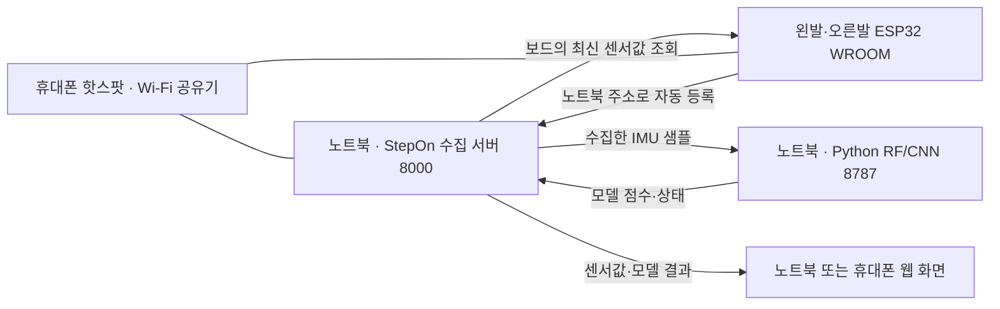

# 휴대폰 핫스팟으로 WROOM · 노트북 · 웹 · AI 연결

휴대폰은 Wi-Fi 공유기 역할을 하고, **웹 서버·센서 수집·RF/CNN은 노트북에서 실행**합니다. 노트북과 왼발·오른발 ESP32를 모두 같은 휴대폰 핫스팟에 연결합니다.



그림의 자동 등록·센서 조회도 휴대폰의 Wi-Fi 네트워크를 통해 통신합니다. Python 포트 8787에는 노트북의 웹 서버가 내부 접속하므로 ESP32나 휴대폰에서 직접 연결할 필요가 없습니다.

## 1. 핫스팟과 노트북 준비

1. 휴대폰 핫스팟을 켜고 **2.4GHz 호환 모드**를 사용합니다. ESP32-WROOM-32는 2.4GHz Wi-Fi를 사용합니다. [Espressif 사양](https://documentation.espressif.com/esp32_wroom-32_datasheet_en.pdf)
2. iPhone 12 이후 모델이라면 **개인용 핫스팟 → 호환성 최대화**를 켜면 2.4GHz로 제한됩니다. [Apple 안내](https://support.apple.com/en-ca/guide/security/secfd166f620/web)
3. 노트북을 그 핫스팟에 Wi-Fi로 연결합니다. 이 구성에서는 노트북의 모바일 핫스팟을 별도로 켤 필요가 없습니다.
4. 저장소의 `check-network.bat`을 실행합니다. 연결된 어댑터별 **Laptop IPv4**와 `PC_HOST`에 넣을 코드가 출력됩니다. 여러 주소가 나오면 휴대폰 핫스팟에 연결한 Wi-Fi 어댑터를 선택합니다.

예를 들어 노트북 `172.20.10.2`, 게이트웨이 `172.20.10.1`이 나오면:

| 주소 | 의미 | 사용 |
|---|---|---|
| `172.20.10.1` | 휴대폰/게이트웨이 | ESP32가 DHCP로 자동 사용 |
| `172.20.10.2` | 노트북 | ESP32의 `PC_HOST` |
| 시리얼에 표시되는 각 ESP32 IP | 왼발/오른발 보드 | 자동 등록 실패 시 웹에 직접 입력 |

위 주소는 예시입니다. 실제 값은 `check-network.bat` 또는 `ipconfig`로 매번 확인합니다. 핫스팟 재연결 후 IP가 바뀔 수 있습니다.

## 2. WROOM 펌웨어 설정

Arduino IDE에서 [`04_2_sta_bilateral_wroom.ino`](../firmware/stepon_c3/04_2_sta_bilateral_wroom/04_2_sta_bilateral_wroom.ino)를 엽니다. USB CSV 전용 06 코드는 이 Wi-Fi 등록 기능을 제공하지 않습니다.

**`wifi_secrets.h`**에는 휴대폰 핫스팟의 실제 이름과 비밀번호를 넣습니다. 파일이 없으면 같은 폴더의 `wifi_secrets.example.h`를 복사합니다.

```cpp
#pragma once
constexpr const char *WIFI_SSID = "휴대폰 핫스팟 이름";
constexpr const char *WIFI_PASSWORD = "휴대폰 핫스팟 비밀번호";
```

**`config.h`**의 `PC_HOST`는 노트북 Wi-Fi IPv4로 설정합니다. `http://`나 `:8000`을 붙이지 않습니다.

```cpp
constexpr const char *PC_HOST = "172.20.10.2"; // 예시: 현재 노트북 IPv4
constexpr uint16_t PC_PORT = 8000;
```

`PC_HOST = ""`는 게이트웨이를 사용하므로, **휴대폰 핫스팟에서는 등록 요청이 휴대폰으로 가 버립니다.** 노트북이 직접 핫스팟을 제공할 때만 빈 값을 사용합니다.

좌우 설정을 바꿔 각 보드에 따로 업로드합니다.

```cpp
#define STEPON_RIGHT_FOOT 0  // 왼발에 업로드
// 오른발에 업로드할 때는 위 줄의 0을 1로 변경
```

Wi-Fi 정보와 `PC_HOST`는 양쪽에 동일하게 넣습니다. 기존에 맞춘 센서 GPIO 배선은 네트워크 변경 때문에 바꾸지 않습니다. 실제 배선에 맞게 설정한 `MUX_S2` 등 핀 값을 유지합니다. GPIO12를 사용한다면 앞서 안내한 부팅 시 LOW 조건도 유지해야 합니다.

## 3. 실행과 연결 확인

1. 노트북에서 `run.bat`을 실행합니다. 새 노트북이면 [최초 설치](RUNNING.md)를 먼저 진행합니다.
2. 양쪽 ESP32를 켭니다. 시리얼 모니터 **115200 baud**에서 `STA connected`, 각 보드 IP, `foot=left/right`, `[PC] registration HTTP=200`을 확인합니다.
3. [노트북 기기 관리 화면](http://127.0.0.1:8000/?view=devices&esp32=1&transport=sta&ai=1&mobile=0)에서 좌우 **실센서 연결**과 새 프레임 수신을 확인합니다.
4. 자동 등록이 안 되지만 보드 API는 열리면 해당 발 카드의 **IP 직접 등록**에 `http://보드IP`를 입력합니다.
5. AI 화면에서 각 발 **5초 정지 + 20초 일반 보행** 보정을 완료하고 새 유효 4초 창이 들어오면 모델 판단을 확인합니다. 데이터 연결과 모델의 실사용 정확도 검증은 별개의 과정입니다.

휴대폰에서 같은 웹을 볼 때는 노트북 주소를 사용합니다. 예:

```text
http://172.20.10.2:8000/mobile?esp32=1&transport=sta&ai=1
http://172.20.10.2:8000/data/
```

휴대폰의 `127.0.0.1`은 노트북이 아닙니다. 웹 주소의 IP는 실제 노트북 주소로 바꿉니다.

## 4. 연결 문제를 구분하는 방법

`check-network.bat`은 IP·서버 수신 주소·양발 등록 상태를 읽기만 합니다. 비밀번호, 방화벽, 등록 정보, 출력 장치를 변경하지 않습니다. 보드 IP를 알고 있으면 PowerShell에서 다음처럼 추가 점검할 수 있습니다.

```powershell
.\check-network.bat -DeviceIp 172.20.10.3
```

`172.20.10.3`은 예시이므로 시리얼의 실제 ESP32 IP로 바꿉니다.

| 확인 결과 | 다음 확인 |
|---|---|
| ESP32에 IP가 생기지 않음 | 핫스팟 이름·비밀번호, 2.4GHz, 보드 전원 |
| ESP32가 폰에는 연결됐지만 등록 실패 | `PC_HOST`가 노트북인지, `run.bat` 실행 여부, 노트북 TCP 8000 방화벽 |
| 노트북에서 `http://보드IP/api/ping`도 안 열림 | 보드의 현재 IP, 4-2 펌웨어, 핫스팟의 기기 간 통신 가능 여부 |
| 노트북에서는 웹이 열리지만 폰/보드에서 접근 실패 | 웹의 LAN 수신 설정, Windows 방화벽 프로필, 핫스팟 기기 간 통신 제한 |
| 양발 연결됐지만 AI 점수 없음 | 해당 발 IMU 정상 여부, 실제 수집률, 보정 완료와 새 4초 창 |

`run.bat`은 웹 8000을 `0.0.0.0`으로 실행합니다. 수동 실행할 경우에도 `node cap_web/dev-server.mjs 8000 0.0.0.0`처럼 LAN 수신 주소가 필요합니다. 정상 실행 중인 서버를 중복으로 켜지 않습니다.

Windows 방화벽에서는 **Node/StepOn의 TCP 8000 수신을 현재 연결한 로컬 네트워크에 허용**합니다. 방화벽 전체를 끄거나 인터넷 포트 포워딩을 할 필요가 없습니다. 휴대폰 핫스팟이 연결 기기 간 통신을 차단하는 경우에는 이 로컬 구조가 동작하지 않으므로, 해당 설정을 확인하거나 기기 간 통신이 가능한 핫스팟/공유기/노트북 핫스팟을 사용합니다.

## 검증 범위

WROOM STA 프레임 → 수집 서버 → 실제 RF/CNN → 웹 응답은 기존 모의 센서 연동 검사로 검증돼 있습니다. 휴대폰 핫스팟에서 실제 보드까지 연결됐다는 확인은 양발 등록·프레임·보정 상태로 별도로 합니다. 실행 파일과 진단 도구만으로 실제 무선 품질이나 착용 시 모델 정확도가 보장되지는 않습니다.
